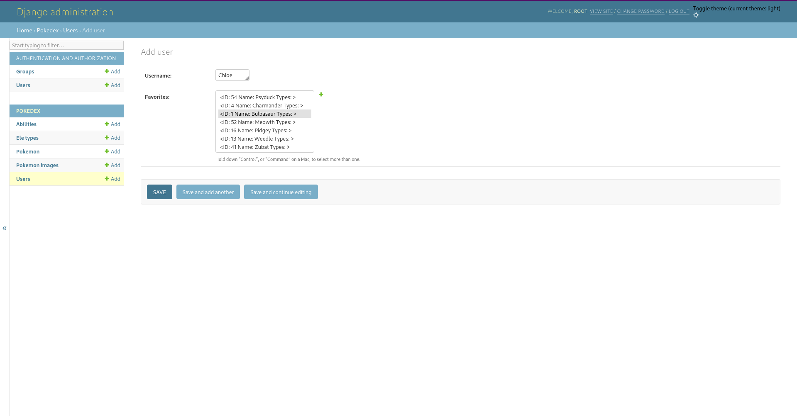

# Project Milestone: Complete Implementation

Pokedex\
Jonah Scudere-Weiss, Audrey Roller, Chloe Halverson, & Skye Whitlow 

This Pokedex supports viewing of data for all Pokemon from Generation 1 to 5. The database is automatically populated with all sprites of each Pokemon, giving a complete view of the official art of each one. A user can navigate with the stylized bar on the left (or on the bottom on mobile) to select a Pokemon, and then view their stats, typing, and evolution chains. 
The Pokedex has been designed with an eye towards including fan art, so it supports a carousel of an unbounded amount of images for each Pokemon. Although no fanart has been uploaded, this level of preparation in the design makes the Pokedex ready for it, should it be needed.

## Screenshots

As this project's database is mostly static, the screenshots below show the data being requested by the Pokedex page, as well as the admin panel where it can be modified, should discrepancies be found.

The database's data itself was loaded by two Python/Shell scripts, which are also screenshotted below.

